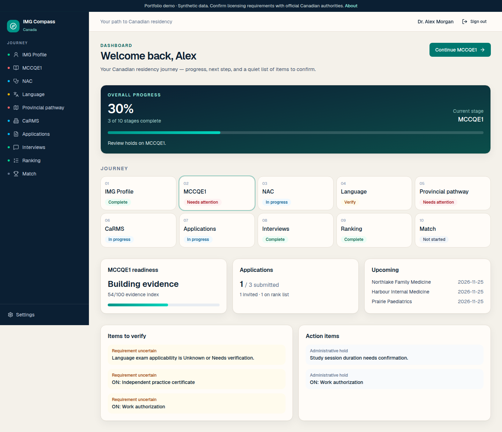
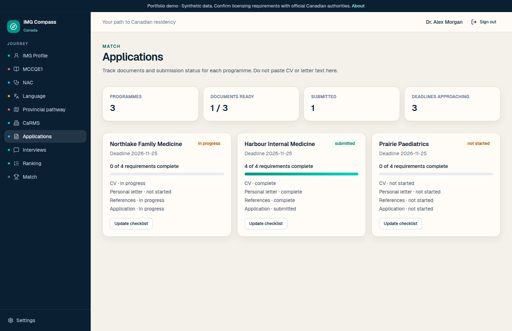
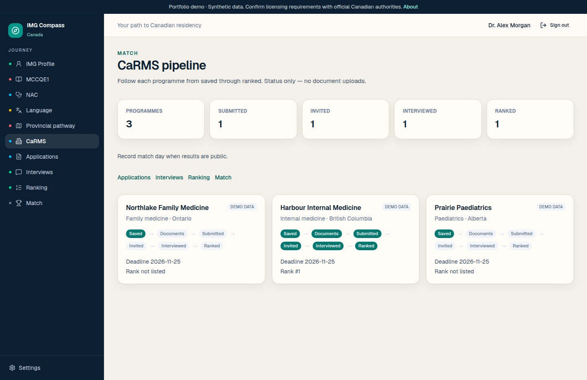
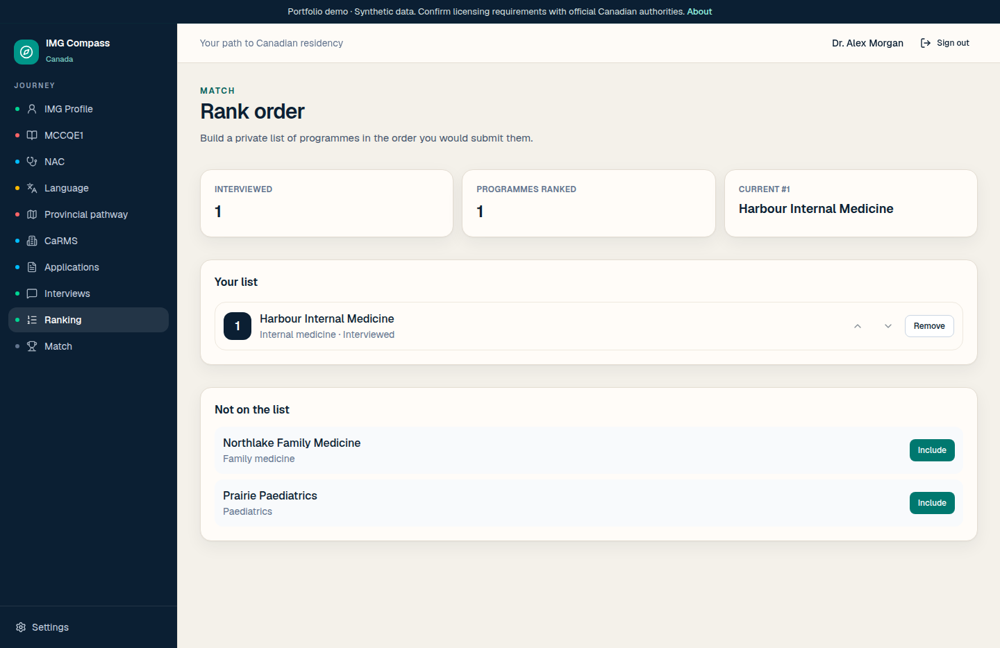
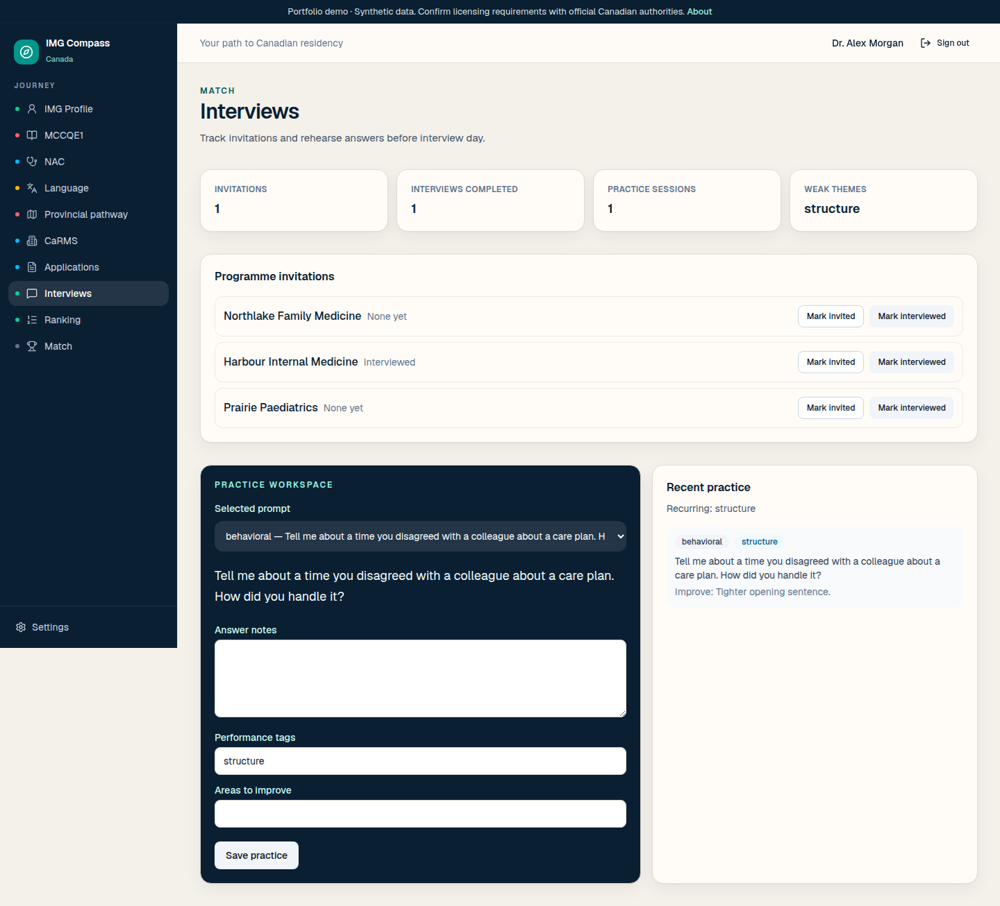
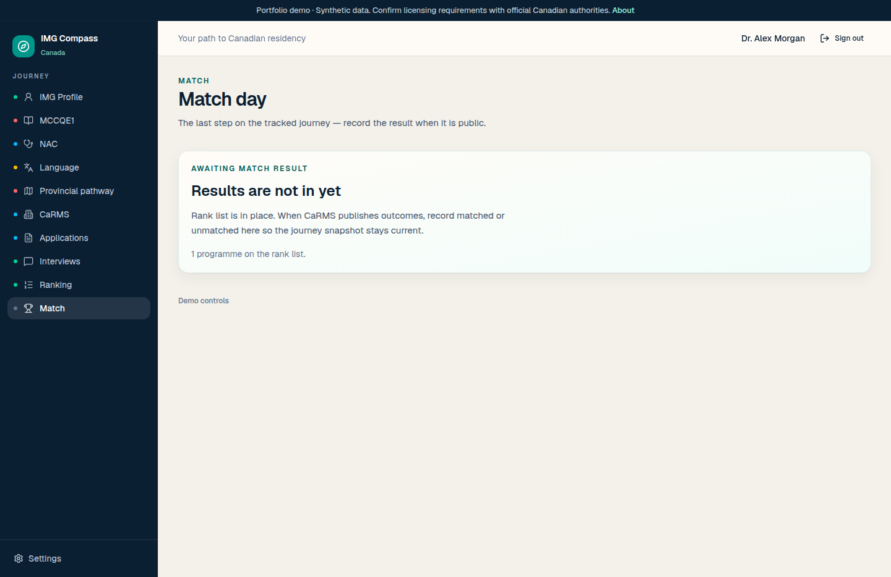
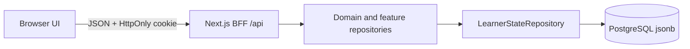
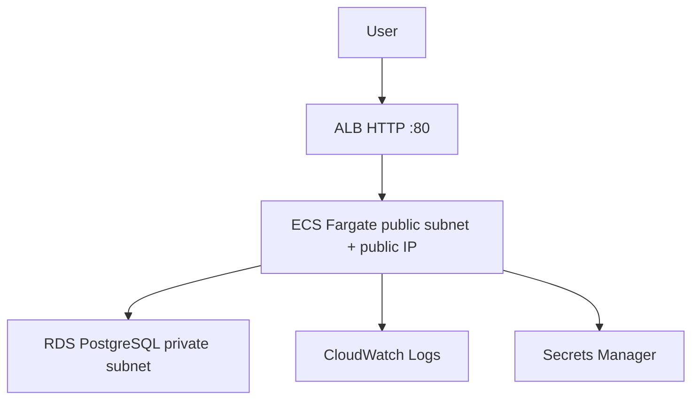
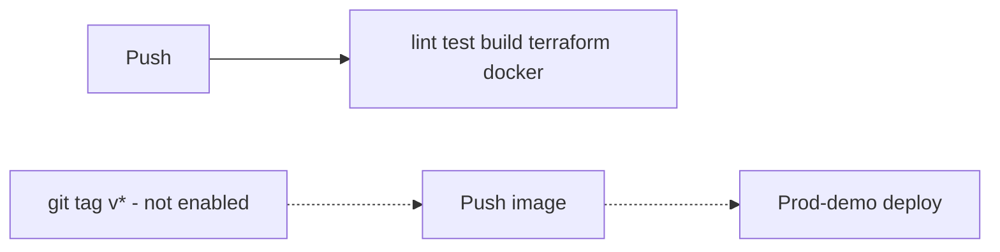

# IMG Compass Canada

**Your complete journey from IMG to Canadian residency — in one place.**

A personal navigation and tracking workspace for International Medical Graduates. It organizes pathway planning, credentials, MCCQE and NAC preparation, language evidence, provincial and program research, CaRMS applications, interviews, ranking, Match Day, and residency onboarding.

This is **not** medical, legal, or licensing advice, and it is **not** affiliated with the Medical Council of Canada, CaRMS, or any provincial regulator. Confirm every requirement with official sources.

Open the workspace as fictional **Dr. Alex Morgan**. All learner activity shown in this portfolio demo is synthetic. Real faculty names and official URLs are used for navigation.

[Apache License 2.0](LICENSE) · [NOTICE](NOTICE) · [V2 plan](docs/V2-PLAN.md)

---

## Problem

IMGs aiming for Canadian residency juggle MCCQE1, NAC, language exams, provincial paperwork, and CaRMS — usually across spreadsheets and bookmarks. IMG Compass Canada turns that into a **derived journey**: one profile, classified holds, and a match pipeline from saved programmes through rank order and match day.

The application is a portfolio demonstration of product and platform engineering: real AWS architecture and ops patterns, synthetic clinical content only.

## Product features

- **Demo entry** as Dr. Alex Morgan (synthetic learner; not a public registration product)
- **Dashboard** with a navy hero, Daily Compass (date-rotated generic and medical/physician/IMG messages), five-phase Journey Progress, derived priorities, readiness cards, milestones, and saved programmes
- **Residency Pathway Progress** — compact stage chart derived from tracker records (no invented study-time or exam-score analytics)
- **7-step onboarding** that builds a personalized path
- **IMG profile** with section completeness (not a fake 100%)
- **My Journey** from profile through credentials, exams, provinces, programs, CaRMS, match, and residency
- **MCCQE** exam tracker + preparation logs + official MCC links
- **NAC** exam tracker + practice center
- **Language** catalog (not hard-coded to three exams forever)
- **Provincial pathways** with real CaRMS R-1 faculties and official sources
- **Program Explorer** (institution research records; 2027 descriptions are not fabricated)
- **CaRMS hub** with published 2027 first-iteration dates and last-verified metadata
- **Applications → Interviews → Ranking → Match** as one store
- **About** page describing what Compass is and is not (product-facing; architecture lives in this README and `docs/`)

Settings resets demo data only for the demo learner.

## Screenshots

Synthetic UI (Dr. Alex Morgan). Full pack: [`docs/screenshots/`](docs/screenshots/).

| Dashboard | Applications |
| --- | --- |
|  |  |

| CaRMS pipeline | Rank order |
| --- | --- |
|  |  |

| Interviews | Match day |
| --- | --- |
|  |  |

## Architecture

Single **Next.js** App Router application. The browser talks to Next.js route handlers (BFF). Domain logic and feature repositories do not know about Postgres. Journey status is **computed**, not stored as percentages. This stack does not call LLM APIs.



**Local default:** `NEXT_PUBLIC_PERSISTENCE=local` — browser `localStorage`. Same domain code, no database.

**Remote:** `NEXT_PUBLIC_PERSISTENCE=remote` — `GET`/`PUT /api/state` persists a versioned JSON document. The browser **never** receives `DATABASE_URL`.

Layers: [`docs/architecture.md`](docs/architecture.md).

## Tech stack

| Area | Choice |
| --- | --- |
| UI | Next.js 16, React 19, TypeScript, Tailwind CSS, shadcn/ui |
| Domain | Pure TypeScript modules + feature repositories |
| Persistence | localStorage **or** Postgres 16 via `pg` |
| App server | Next standalone `server.js` (production) |
| Infra | Terraform, ECS Fargate, ALB, RDS, ECR, Secrets Manager, CloudWatch |
| CI | GitHub Actions (lint, test, build, Terraform validate, Docker build) |

## AWS deployment architecture

Region **ca-central-1**. One Fargate task behind an ALB, private RDS, **no NAT Gateway**.

Cost-conscious network: tasks in **public** subnets with a public IP so they can pull ECR and write logs without NAT. Inbound **tcp/43210 only from the ALB security group**. RDS stays in **private** subnets; **5432 only from the ECS security group**.



Validated apply (account IDs, ARNs, and DB endpoints omitted): [`docs/AWS-DEPLOYMENT-EVIDENCE.md`](docs/AWS-DEPLOYMENT-EVIDENCE.md).

HTTPS is not enabled on the default `*.elb.amazonaws.com` hostname; ACM requires a domain you control. [`docs/HTTPS.md`](docs/HTTPS.md).

### Temporary live demo

HTTP only (browsers show “Not secure”). Synthetic data.

http://img-compass-prod-demo-1496842689.ca-central-1.elb.amazonaws.com/

This URL is a short-lived portfolio runtime. If it is later parked or removed, use the screenshots above and the evidence pack — the repository, Terraform, and CI remain the source of truth.

## Terraform / IaC

`terraform/` provisions VPC (public + private), ALB, ECS Fargate (0.5 vCPU / 1 GB), RDS Postgres 16 `db.t4g.micro`, security groups, Secrets Manager, CloudWatch (14-day logs), and optional ACM HTTPS.

- Remote state: S3 + DynamoDB lock (`terraform/bootstrap/`, applied separately)
- Image URI lives in **gitignored** `terraform.tfvars` (see `terraform.tfvars.example`)
- `active.tfvars` — desired count 1, ALB on
- `parked.tfvars` — desired count 0, ALB removed (RDS remains until stopped or destroyed)
- `terraform/oidc/` — GitHub Actions OIDC roles (Terraform is ready; **not applied** in this environment)

Do not commit `backend.hcl` or `terraform.tfvars`.

## CI/CD

**CI is active** on this repository. Push and pull-request workflows run lint, tests, production build, Terraform `fmt`/`validate`, and a Docker image build (no push to ECR).

**AWS continuous deploy is prepared but not enabled.** Tag and rollback workflows exist (`.github/workflows/deploy-prod-demo.yml`, `deploy-staging.yml`, `rollback.yml`) and are designed for GitHub OIDC (`AWS_ROLE_ARN` on GitHub Environments). Those Environments and IAM OIDC roles are **not configured** here, so GitHub Actions does **not** currently deploy to AWS. Deploys were applied with Terraform from a trusted workstation. See [`docs/GITHUB-OIDC.md`](docs/GITHUB-OIDC.md).



No long-lived AWS access keys in Actions.

## Observability / SRE

| Endpoint | Role |
| --- | --- |
| `GET /api/health` | Liveness (ALB target) |
| `GET /api/ready` | Postgres `select 1` when `DATABASE_URL` is set; reports RDS TLS verify flags |
| `GET /api/metrics` | In-process counters (`http_requests`, `persist_saves`, `persist_errors`) |

JSON logs include `requestId` (`x-request-id`). SLIs/SLOs: [`docs/sre.md`](docs/sre.md). Runbooks: `docs/runbooks/`.

## Security

- Demo authentication only (HttpOnly `compass_learner` cookie). Not a real IdP. Not HIPAA/PHIPA/PIPEDA certified
- No CV, passport, or MCC ID uploads
- RDS is not publicly accessible; `DATABASE_URL` is in Secrets Manager, never `NEXT_PUBLIC_*`
- Production RDS TLS uses the packaged Amazon RDS **ca-central-1** CA bundle (`rejectUnauthorized: true`)
- `scripts/dev.mjs` (Cloud Preview origin stripping) is **local only** and is not in the production image
- [`docs/security.md`](docs/security.md)

## Cost-conscious lifecycle

The AWS stack is an **on-demand portfolio environment** (order of magnitude **USD 2–4/day** while active: ALB + Fargate + RDS micro + public IPv4). There is **no NAT**.

| State | What you pay for |
| --- | --- |
| **Active** | ALB + 1 Fargate task + RDS + logs |
| **Parked** | No Fargate, no ALB; RDS still exists until stopped or destroyed |
| **Destroyed** | App stack removed; bootstrap ECR + Terraform state can remain for a cheap restore |

Details: [`docs/OPERATIONS-LIFECYCLE.md`](docs/OPERATIONS-LIFECYCLE.md), [`docs/LOW-COST-AWS.md`](docs/LOW-COST-AWS.md).

## Local setup

```bash
npm ci
npm run dev
```

Open [http://127.0.0.1:43210](http://127.0.0.1:43210). Continue as Dr. Alex.

```bash
npm run lint
npm test
npm run build
```

Production locally is `node .next/standalone/server.js` after `npm run build` (static files copied as in the Dockerfile). `npm run dev` is a development proxy for Cloud Preview only.

```bash
docker compose up --build   # optional: Postgres BFF on the same image CMD as ECS
```

Copy `.env.example` if you need remote persistence locally. Never put RDS credentials in `NEXT_PUBLIC_*`.

## Deployment notes

1. CI on `main`: lint, tests, production build, Terraform validate, image build.
2. Image `CMD` is `node db/migrate.mjs && node server.js` — never `npm run dev`.
3. Push the image to ECR; set `container_image` in gitignored `terraform.tfvars`.
4. `terraform apply -var-file=active.tfvars -var-file=terraform.tfvars` after reviewing the plan.
5. Confirm `/api/health` and `/api/ready` (`tls.verified: true` in Postgres mode).

Runbook: [`docs/runbooks/deploy.md`](docs/runbooks/deploy.md).

## Demo identity

The in-app experience is a **product workspace** for IMGs, not a public registration product. Continue as **Dr. Alex Morgan** to explore the pathway. Account sign-up, password reset, and a hosted IdP are intentionally out of scope for this portfolio runtime. Architecture for optional cookie sessions remains in the codebase; it is not presented as a consumer signup flow.

## Synthetic data

Learner records, catalogs, NAC stations, interview prompts, programmes, and provincial requirement rows are **synthetic**. They illustrate architecture and workflow, not official MCC, NAC, CaRMS, or college rules. Scores and “eligibility” labels are planning records, not exam or licensing outcomes.

The app uses a **synthetic demo learner** (Dr. Alex Morgan) rather than a production identity platform. Entry, About, and this README disclose that. There is no global warning banner in the product UI.

## Engineering ownership

I defined and directed product requirements, application architecture, AWS platform design, Terraform/IaC strategy, persistence design (BFF + `LearnerStateRepository`), CI/CD strategy, SRE/observability, security controls, deployment and validation, and the cost-conscious park/destroy lifecycle.

AI-assisted development tools accelerated implementation and documentation. The fuller disclosure is in [NOTICE](NOTICE).

## Docs

| Doc | Purpose |
| --- | --- |
| [docs/architecture.md](docs/architecture.md) | Layers and request path |
| [docs/sre.md](docs/sre.md) | SLI/SLO |
| [docs/security.md](docs/security.md) | Threat notes |
| [docs/AWS-DEPLOYMENT-EVIDENCE.md](docs/AWS-DEPLOYMENT-EVIDENCE.md) | Applied AWS validation (redacted) |
| [docs/OPERATIONS-LIFECYCLE.md](docs/OPERATIONS-LIFECYCLE.md) | Deploy / park / restore / cost |
| [docs/HTTPS.md](docs/HTTPS.md) | ACM / custom domain |
| [docs/GITHUB-OIDC.md](docs/GITHUB-OIDC.md) | GitHub OIDC (prepared, not enabled) |
| [docs/INTERVIEW-GUIDE.md](docs/INTERVIEW-GUIDE.md) | Talking points |
| [CHANGELOG.md](CHANGELOG.md) | SemVer |
