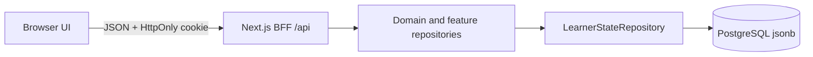
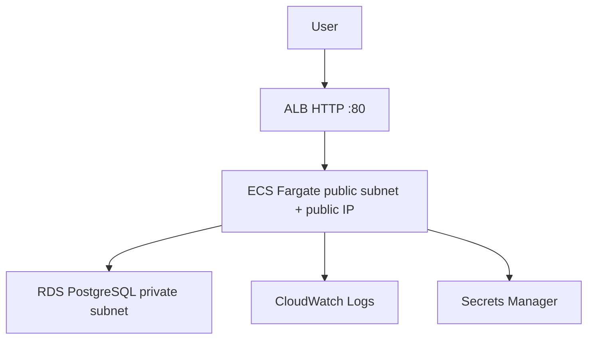
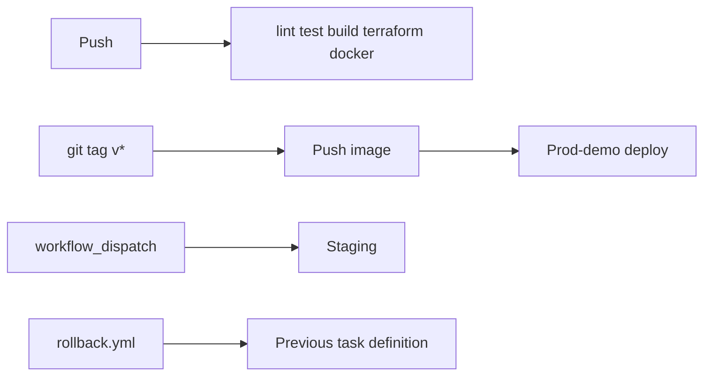

# IMG Compass Canada

**Your path to Canadian residency**

A planning workspace for International Medical Graduates (IMGs) who need one place to track exams, provincial requirements, and the CaRMS match cycle.

This is **not** medical, legal, or licensing advice, and it is **not** affiliated with the Medical Council of Canada, CaRMS, or any provincial regulator. Confirm every requirement with official sources. The in-app learner is a fictional **Dr. Alex Morgan**. Catalogs, stations, programmes, and provincial rows are **synthetic**.

[Apache License 2.0](LICENSE) · [NOTICE](NOTICE) (AI-assisted development + synthetic-data disclosure)

---

## Problem

IMGs aiming for Canadian residency juggle MCCQE1, NAC, language exams, provincial paperwork, and CaRMS — usually across spreadsheets and bookmarks. IMG Compass Canada turns that into a **derived journey**: one profile, classified holds, and a match pipeline from saved programmes through rank order and match day.

It is a portfolio-grade product demo: real architecture and AWS ops, synthetic clinical content only.

## Product features

- **IMG profile** and a computed journey (profile → MCCQE1 → NAC → language → provincial → CaRMS → applications → interviews → ranking → match)
- **MCCQE1** session logging, accuracy, duration safeguards, and interval review on original **Compass** catalogs (not paid publisher banks)
- **NAC** timed stations and self-scored attempts
- **Language** evidence (OET / IELTS / CELPIP) with applicability you classify, not a national rule
- **Provincial pathway** tracker with quiet “Demo data” chips — red is reserved for real blockers
- **CaRMS pipeline** with visual stages: Saved → Documents → Submitted → Invited → Interviewed → Ranked
- **Applications** workspace: programme summary, checklists, expandable document controls
- **Interviews** prep dashboard and a focused practice workspace
- **Rank order** list with include/exclude and reorder
- **Match day** awaiting / matched / unmatched states (demo outcome controls are tucked away)

Demo sign-in is one click. Settings resets to the Dr. Alex Morgan seed.

## Screenshots

Synthetic UI only (Dr. Alex Morgan). Full pack: [`docs/screenshots/`](docs/screenshots/).

| Dashboard | Applications |
| --- | --- |
|  |  |

| CaRMS pipeline | Rank order |
| --- | --- |
|  |  |

| Interviews | Match day |
| --- | --- |
|  |  |

## Architecture

Single **Next.js** App Router app. The browser talks to Next.js route handlers (BFF). Domain logic and feature repositories do not know about Postgres. Journey status is **computed**, not stored as percentages.



**Local default:** `NEXT_PUBLIC_PERSISTENCE=local` — browser `localStorage`. Same domain code, no database.

**Remote / AWS:** `NEXT_PUBLIC_PERSISTENCE=remote` — `GET`/`PUT /api/state` persists a versioned JSON document. The browser **never** receives `DATABASE_URL`.

Layers: [`docs/architecture.md`](docs/architecture.md).

## Tech stack

| Area | Choice |
| --- | --- |
| UI | Next.js 16, React 19, TypeScript, Tailwind CSS, shadcn/ui |
| Domain | Pure TypeScript modules + feature repositories |
| Persistence | localStorage **or** Postgres 16 via `pg` |
| App server | Next standalone `server.js` (production) |
| Infra | Terraform, ECS Fargate, ALB, RDS, ECR, Secrets Manager, CloudWatch |
| CI | GitHub Actions (lint, test, build, Terraform validate, Docker build) |

V1 does **not** call LLM APIs and does not use Azure.

## AWS deployment (live prod-demo)

Region **ca-central-1**. One Fargate task behind an ALB, private RDS, **no NAT Gateway**.

Cost-conscious network (**Option B**): tasks in **public** subnets with a public IP so they can pull ECR and write logs without NAT. Inbound **tcp/43210 only from the ALB security group**. RDS stays in **private** subnets; **5432 only from the ECS security group**.



Evidence (account IDs, ARNs, and DB endpoints omitted): [`docs/AWS-DEPLOYMENT-EVIDENCE.md`](docs/AWS-DEPLOYMENT-EVIDENCE.md). HTTPS on the default `*.elb.amazonaws.com` hostname is not possible; ACM needs a domain you control — [`docs/HTTPS.md`](docs/HTTPS.md).

The HTTP demo URL (synthetic data):

http://img-compass-prod-demo-1496842689.ca-central-1.elb.amazonaws.com/

## Terraform / IaC

`terraform/` provisions VPC (public + private), ALB, ECS Fargate (0.5 vCPU / 1 GB), RDS Postgres 16 `db.t4g.micro`, security groups, Secrets Manager, CloudWatch (14-day logs), and optional ACM HTTPS.

- Remote state: S3 + DynamoDB lock (`terraform/bootstrap/`, applied separately)
- Image URI lives in **gitignored** `terraform.tfvars` (see `terraform.tfvars.example`)
- `active.tfvars` — desired count 1, ALB on
- `parked.tfvars` — desired count 0, ALB removed (RDS remains until you stop or destroy it)
- `terraform/oidc/` — GitHub Actions OIDC roles (not applied until a GitHub environment exists)

Never commit `backend.hcl` or `terraform.tfvars`.

## CI/CD



Workflows assume AWS **OIDC** (`AWS_ROLE_ARN` on GitHub Environments). No long-lived access keys in Actions. See [`docs/GITHUB-OIDC.md`](docs/GITHUB-OIDC.md).

## Observability / SRE

| Endpoint | Role |
| --- | --- |
| `GET /api/health` | Liveness (ALB target) |
| `GET /api/ready` | Postgres `select 1` when `DATABASE_URL` is set; reports RDS TLS verify flags |
| `GET /api/metrics` | In-process counters (`http_requests`, `persist_saves`, `persist_errors`) |

JSON logs include `requestId` (`x-request-id`). SLIs/SLOs: [`docs/sre.md`](docs/sre.md). Runbooks: `docs/runbooks/`.

## Security

- Demo authentication only (HttpOnly `compass_learner` cookie). Not a real IdP. Not HIPAA/PHIPA/PIPEDA certified
- No CV, passport, or MCC ID uploads
- RDS is not publicly accessible; `DATABASE_URL` is in Secrets Manager, never `NEXT_PUBLIC_*`
- Production RDS TLS uses the packaged Amazon RDS **ca-central-1** CA bundle (`rejectUnauthorized: true`)
- `scripts/dev.mjs` (Cloud Preview origin stripping) is **local only** and is not in the production image
- [`docs/security.md`](docs/security.md)

## Cost-conscious lifecycle

This AWS stack is an **on-demand portfolio environment** (~USD 2–4/day while active: ALB + Fargate + RDS micro + public IPv4). There is **no NAT**.

| State | What you pay for |
| --- | --- |
| **Active** | ALB + 1 Fargate task + RDS + logs |
| **Parked** | No Fargate, no ALB; RDS still exists until stopped/destroyed |
| **Destroy** | Tear down the app stack; keep bootstrap ECR + Terraform state if you want a cheap restore |

Owner approval is required for destroy. Details: [`docs/OPERATIONS-LIFECYCLE.md`](docs/OPERATIONS-LIFECYCLE.md), [`docs/LOW-COST-AWS.md`](docs/LOW-COST-AWS.md).

## Local setup

```bash
npm ci
npm run dev
```

Open [http://127.0.0.1:43210](http://127.0.0.1:43210). Continue as Dr. Alex.

```bash
npm run lint
npm test
npm run build
```

Production locally is `node .next/standalone/server.js` after `npm run build` (static files copied as in the Dockerfile). `npm run dev` is a development proxy for Cloud Preview only.

```bash
docker compose up --build   # optional: Postgres BFF on the same image CMD as ECS
```

Copy `.env.example` if you need remote persistence locally. Never put RDS credentials in `NEXT_PUBLIC_*`.

## Deployment notes

1. CI on `main` (lint, tests, production build, Terraform validate, image build).
2. Image `CMD` is `node db/migrate.mjs && node server.js` — never `npm run dev`.
3. Push to ECR; set `container_image` in gitignored `terraform.tfvars`.
4. `terraform apply -var-file=active.tfvars -var-file=terraform.tfvars` (owner-approved).
5. Confirm `/api/health` and `/api/ready` (`tls.verified: true` in Postgres mode).

Runbook: [`docs/runbooks/deploy.md`](docs/runbooks/deploy.md).

## Synthetic-data disclaimer

Learner records, catalogs, NAC stations, interview prompts, programmes, and provincial requirement rows are **synthetic**. They exist to show product architecture and workflow. They are not official MCC, NAC, CaRMS, or college content. Do not treat scores or “eligibility” labels as exam or licensing outcomes.

The product shows **one** global portfolio banner plus an About page in the app. It does not repeat legal boxes on every screen.

## AI-assisted development

Portions of this repository were produced with AI coding assistance under human direction. That does **not** mean the product was undirected. See [NOTICE](NOTICE).

### What I directed and owned

- Product scope, IMG journey, and disclaimer rules (synthetic data, no paid Qbank content, no real identity)
- Architecture: BFF so the browser never holds `DATABASE_URL`; persistence ports; derived journey; hold taxonomy
- Platform: ECS Fargate instead of EKS; private RDS; no NAT; no AI APIs in V1
- Terraform shape, park/destroy cost model, and HTTPS-requires-a-domain constraint
- DevOps: GitHub Actions, tag deploy, rollback, OIDC (no long-lived keys in CI)
- SRE: health vs ready, JSON logs, request IDs, runbooks
- Release gates: public GitHub only after a secret/account-ID audit; LinkedIn still owner-gated

### What AI assistance implemented

UI, domain modules, adapters, IaC files, and documentation under that direction, then iterated from review.

## Docs

| Doc | Purpose |
| --- | --- |
| [docs/architecture.md](docs/architecture.md) | Layers and request path |
| [docs/sre.md](docs/sre.md) | SLI/SLO |
| [docs/security.md](docs/security.md) | Threat notes |
| [docs/AWS-DEPLOYMENT-EVIDENCE.md](docs/AWS-DEPLOYMENT-EVIDENCE.md) | Live AWS validation (redacted) |
| [docs/OPERATIONS-LIFECYCLE.md](docs/OPERATIONS-LIFECYCLE.md) | Deploy / park / restore / cost |
| [docs/HTTPS.md](docs/HTTPS.md) | ACM / custom domain |
| [docs/GITHUB-OIDC.md](docs/GITHUB-OIDC.md) | GitHub OIDC |
| [docs/INTERVIEW-GUIDE.md](docs/INTERVIEW-GUIDE.md) | Talking points |
| [CHANGELOG.md](CHANGELOG.md) | SemVer |
