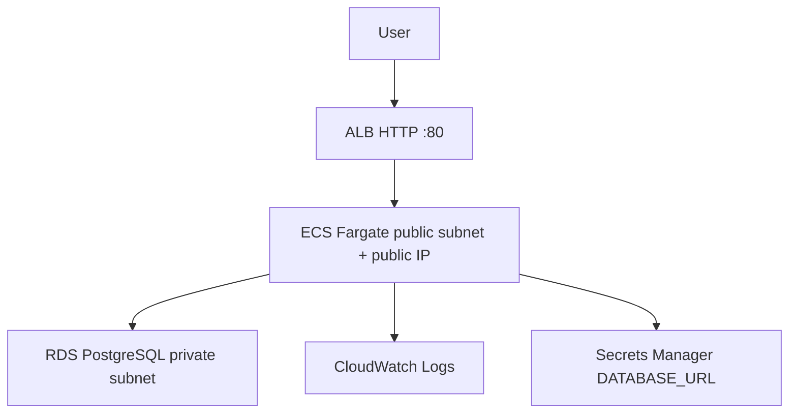

# AWS deployment evidence — 28 Aug 2026 (TLS verified)

Region: **ca-central-1**. Deploy principal: IAM role `img-compass-canada-deploy` (assumed). **No NAT Gateway.**

**Temporary live demo** (HTTP; ACM/HTTPS not enabled). This URL may be parked or removed; screenshots in `docs/screenshots/` remain:

http://img-compass-prod-demo-1496842689.ca-central-1.elb.amazonaws.com/

Account numbers, secret ARNs, database endpoints, and credentials are **omitted** from this document and from `docs/evidence/`.

## Validation (final approved UI, 30 Aug 2026, commit e144970)

| Check | Result |
| --- | --- |
| Git commit | `e144970a382821c3d4734566d08f7c66dc66b01b` (`public-main`) |
| ECR `img-compass-prod-demo:e144970` | Pushed `sha256:d0ae95d71641aac144f8ddf32265ac29eb86464b125c8b1d563c3859beb9acaf` |
| Terraform plan / apply | Task definition replacement + ECS service in-place update only. **No RDS replacement. No NAT.** |
| ECS Fargate | Task definition revision **7**; desired/running **1 / 1**; rollout COMPLETED |
| ALB target | **healthy** on port 43210 |
| `GET /` | 200 |
| `GET /dashboard` after demo cookie | 200 |
| `GET /api/health` | 200 `{"status":"ok","service":"img-compass-canada"}` |
| `GET /api/ready` | 200 `{"ready":true,"persistence":"postgres","tls":{"rejectUnauthorized":true,"verified":true}}` |
| `GET /api/metrics` | 200 metrics JSON |
| Demo sign-in + `PUT`/`GET /api/state` | Round-trip persisted for synthetic **Dr. Alex Morgan** |
| RDS `img-compass-prod-demo` | Not publicly accessible; `db.t4g.micro`; Postgres 16; CA `rds-ca-rsa2048-g1` |
| RDS TLS | `rejectUnauthorized: true`; CloudWatch `migrate_ok` / `pg_pool_created` with `tlsVerified: true` |
| RDS SG | tcp **5432** only from the ECS security group |
| ECS SG | tcp **43210** only from the ALB security group |
| NAT Gateways in VPC | **none** |
| CloudWatch `/ecs/img-compass-prod-demo` | JSON logs; `requestId` matches `x-request-id` |
| Cognito | Not enabled |
| Destroy | **Not run** — runtime left active for owner review |

Evidence files: [`docs/evidence/aws-2026-08-30/`](evidence/aws-2026-08-30/) (`live-entry.webp`, `live-dashboard.webp`, `live-programs.webp`, `live-about.webp`, `live-dashboard-mobile.webp`).

## Validation (learner rename, image v0.4.3)

| Check | Result |
| --- | --- |
| ECR `img-compass-prod-demo:v0.4.3` | Pushed `sha256:13d50d965bdae4f114b98d5a503bbabafd85b3ff944e328bfeb8cfc3407d1eb1` |
| ECS Fargate | Task definition revision **6**; desired/running 1 |
| Demo learner | **Dr. Alex Morgan** on sign-in, dashboard, profile, and `/api/state` |

## Validation (workspace polish, image v0.4.2)

| Check | Result |
| --- | --- |
| ECR `img-compass-prod-demo:v0.4.2` | Pushed `sha256:6e01cf62adb3d53be1b33de17bb4d1fc1825301228926123a5391edb88d71662` |
| ECS Fargate desired / running | 1 / 1 (task definition revision **5**) |
| ALB target | **healthy** on port 43210 |
| `GET /` and journey pages | 200 |
| `GET /api/health` | 200 `{"status":"ok","service":"img-compass-canada"}` |
| `GET /api/ready` | 200 `{"ready":true,"persistence":"postgres","tls":{"rejectUnauthorized":true,"verified":true}}` |
| `GET /api/metrics` | 200 metrics JSON |
| Demo sign-in + `PUT`/`GET /api/state` | Synthetic **Dr. Alex Morgan** seed restored; no leftover TLS round-trip notes |
| HTTPS | Not enabled. ACM cannot certify `*.elb.amazonaws.com`. See `docs/HTTPS.md`. |
| Public Git | Curated snapshot of this tree (account IDs omitted) |

## Validation (after RDS CA hardening)

| Check | Result |
| --- | --- |
| ECR `img-compass-prod-demo:v0.3.1` | Pushed `sha256:2362a7da4231182975e9f71ae860428b1c1120c5f4138509eafe4b9ef9d45385` |
| ECS Fargate desired / running | 1 / 1 (task definition revision **2**, rollout COMPLETED) |
| ALB target | **healthy** on port 43210 |
| `GET /` | 200 |
| `GET /api/health` | 200 `{"status":"ok","service":"img-compass-canada"}` |
| `GET /api/ready` | 200 `{"ready":true,"persistence":"postgres","tls":{"rejectUnauthorized":true,"verified":true}}` |
| `GET /api/metrics` | 200 metrics JSON |
| Demo sign-in + `PUT`/`GET /api/state` | Round-trip note `TLS-RDS-ROUNDTRIP-2026-08-28` persisted for fictional **Dr. Alex Morgan** |
| RDS `img-compass-prod-demo` | Not publicly accessible; `db.t4g.micro`; Postgres 16; CA `rds-ca-rsa2048-g1` |
| RDS TLS | Client uses Amazon RDS **ca-central-1** CA bundle; `rejectUnauthorized: true`; `sslmode=require` in the secret (stripped by the client so node-pg does not verify against Alpine system CAs) |
| RDS SG | tcp **5432** only from the ECS security group |
| ECS SG | tcp **43210** only from the ALB security group |
| NAT Gateways in VPC | **none** |
| Terraform state | S3 remote state + DynamoDB lock table `img-compass-tf-locks` (bucket name redacted) |
| CloudWatch `/ecs/img-compass-prod-demo` | JSON logs; `migrate_ok` with `tlsVerified: true`; `pg_pool_created` with `rejectUnauthorized: true`; `requestId` matches `x-request-id` |

## Architecture (as deployed)

Fargate is **not** behind a NAT Gateway. Inbound to the task is only from the ALB security group. RDS has no public IP.

## Evidence files

Latest pack: [`docs/evidence/aws-2026-08-30/`](evidence/aws-2026-08-30/) (commit `e144970`, image tag `e144970`).

Prior pack: `docs/evidence/aws-2026-08-28/`

| File | Contents |
| --- | --- |
| `ecs.json` | Desired/running 1, Fargate, revision 2 |
| `alb-targets.json` | Healthy target on 43210 (IPs omitted) |
| `rds.json` | Private instance metadata (endpoint omitted) |
| `ecr.json` | Image tags and digests |
| `sgs.json` | Ingress by security-group **name** |
| `nat.json` | Zero NAT gateways |
| `terraform-outputs.json` | Public outputs; RDS address redacted |
| `health.json` / `ready.json` / `metrics.json` | Live API bodies |
| `cloudwatch-sample.json` | TLS-verified log lines |
| `signin.png` / `dashboard.png` | Live UI |
| `health-browser.png` / `ready-browser.png` / `metrics-browser.png` | Live API JSON in the browser |

Live UI pack (fictional Dr. Alex Morgan): `docs/screenshots/01-signin.png` … `16-match.png`.

## Fixes during apply (historical)

1. Deploy role needed S3 reads on the **state bucket only**.
2. RDS Free Tier rejected 7-day backups → **1 day** retention.
3. Tasks failed until secret `AWSCURRENT` existed.
4. RDS requires TLS. node-pg treats `sslmode=require` as verify-full against the **system** CA store (Alpine has no Amazon RDS CAs), which produced `SELF_SIGNED_CERT_IN_CHAIN`. **Final configuration:** package `certs/rds-ca-ca-central-1-bundle.pem` and set `rejectUnauthorized: true`. The `no-verify` workaround was removed in **0.3.1**.

## Cost while left running

Order of magnitude **USD 2–4 per day** (ALB + Fargate 0.5 vCPU / 1 GB + RDS `db.t4g.micro` + public IPv4). No NAT. Ask before destroy.
