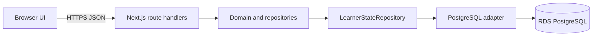
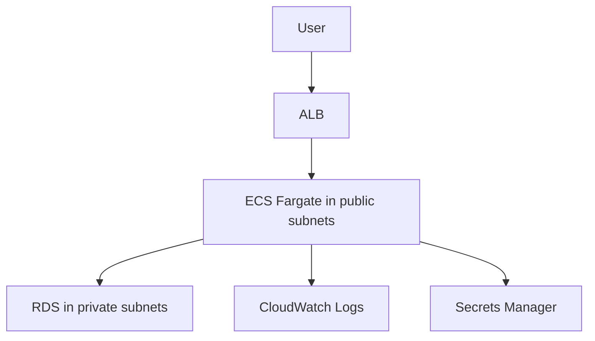
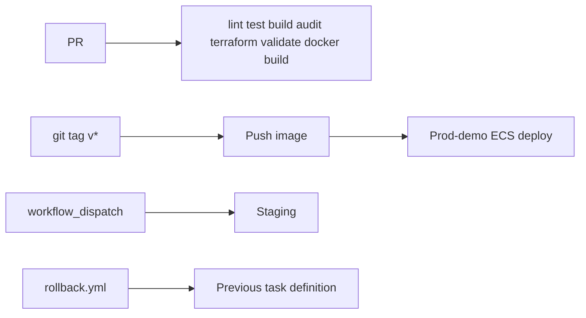

# Architecture

IMG Compass Canada is a **single Next.js monolith**. Azure and AI APIs are out of scope for V1.

## Request path (PostgreSQL mode)

The browser **never** opens a database connection. `DATABASE_URL` is injected on the server from Secrets Manager. RDS TLS is verified with the Amazon RDS ca-central-1 CA bundle (`rejectUnauthorized: true`).

Production and staging traffic uses Next.js standalone `server.js`. Do **not** put `scripts/dev.mjs` (the Origin-stripping Cloud Preview proxy) on those paths. Cross-origin and fetch-metadata checks stay with Next.js / ALB.

## Local / demo mode

`NEXT_PUBLIC_PERSISTENCE=local` (default): `LocalStorageAdapter` in the browser. Useful for workshops and offline demos. Domain code is unchanged.

Local HTTP: **`npm run dev` only** — a development proxy on port 43210 in front of `next dev` on 43211. That proxy is excluded from the production image.

## AWS prod-demo

See `terraform/` for VPC (public + private subnets, **no NAT Gateway**), ALB, optional ACM HTTPS, ECS Fargate (public IP, inbound from ALB only), RDS Postgres 16 (`db.t4g.micro`), ECR scan-on-push, CloudWatch, SSM parameter for the ALB DNS name.

**Applied** in ca-central-1 as the prod-demo. Evidence: `docs/AWS-DEPLOYMENT-EVIDENCE.md`. Image URI is supplied via gitignored `terraform.tfvars`.

## Application layers

| Layer | Location |
| --- | --- |
| UI | `src/app`, `src/components` |
| Domain | `src/domain` |
| Feature repositories (pure) | `src/data/repositories` |
| Persistence ports | `LearnerStateRepository`, `PersistenceAdapter` |
| Postgres adapter | `src/data/postgres-state-repository.ts` |
| BFF | `src/app/api/*` |

## CI/CD

